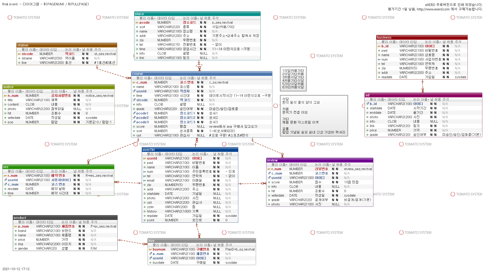
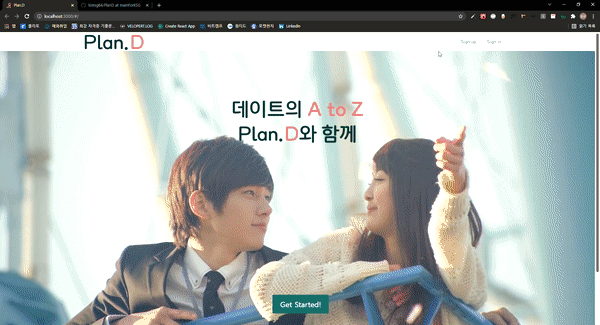
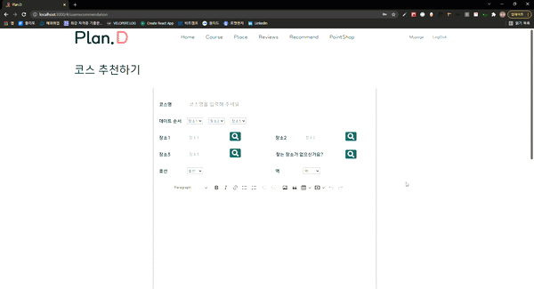
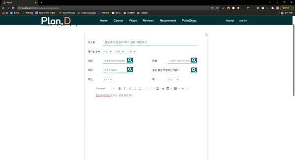

# Plan.D

비트캠프 파이널 프로젝트 PlanD

> "디지털컨버전스 기반 융합기술을 활용한 SW 웹 개발자 양성과정"의 파이널 팀 프로젝트로 제작한 웹사이트 PlanD입니다.

> https://www.youtube.com/watch?v=HVULvaywn4k&t=162s

## 1. 프로젝트 개요

> 

### 개요

- 사용자로부터 날짜 및 시간, 장소, 관심사를 입력받아 데이트 코스를 추천해 주는 웹 플랫폼
  >  

### 목표

- Spring MVC 모델을 활용한 웹 페이지 제작(관리자, 법인 사용자 모드)
- Spring을 활용한 RESTful 서버 구축 및 React.js를 활용한 연동(개인사용자 모드)
- React.js를 이용한 뷰 페이지 제작

### 기간

- 2021.10.04 ~ 2021.10.29

### 기여도

- 사용자 모드 프론트엔드 기여도 100%: 사용자 모드의 뷰 페이지는 React.js를 활용하여 전부 직접 제작했습니다.
- 로그인, 회원가입, 회원정보 수정, 이력 보기 등의 사용자 기능은 프론트엔드뿐만 아니라, Spring 프레임워크를 이용해 RESTful 서버도 직접 구현했습니다.
- 팀장으로서 프로젝트를 총괄하고, 발표회 때 발표를 담당했습니다.

### 프로젝트를 통해 배운 것

- HTML, CSS의 다양한 속성들을 활용함으로써 숙련도를 향상시켰습니다.
- Javascript의 이벤트 관련 개념에 대한 이해도를 향상시켰습니다.
- React.js의 함수형 컴포넌트를 만들고 화면을 구축함으로써 숙련도를 향상시켰습니다.
- axios를 이용해 RESTful 서버와 통신하는 방법을 배우고, 이 때 발생하는 CORS 이슈와 대처 방법을 배웠습니다.
- 팀원들과의 협업 및 형상 관리를 위해 Git을 활용함으로써 Git Flow에 대한 이해도를 향상시켰습니다.

## 2. 기술 스택

### back-end

- OracleDB 18.4.0.
  > Oracle 데이터베이스를 이용해 사용자 정보 및 기타 데이터를 저장했습니다.
- Java 14.0.2. & Spring Framework 5.2.10.
  > Spring MVC 모델 활용 및 RESTful 서버 구축을 위해 Spring 프레임워크를 이용했습니다.
- ojdbc 8 & spring-jdbc 5.2.10.
  > Java 및 Spring 환경에서 Oracle을 사용하기 위해 ojdbc, spring-jdbc 라이브러리를 이용했습니다.
- json-simple 1.1.1.
  > 서버와 클라이언트 사이에서 JSON 형식으로 데이터를 전송하기 위해 이용했습니다.

### front-end

- React.js
  > 프로젝트 목표에 맞게 일반 사용자 모드의 뷰 페이지는 모두 React.js를 이용해 제작했습니다.
- styled-components
  > 컴포넌트 관리 효율성의 향상을 위해 이용하였으며, CSS in JS 방식에 익숙해졌습니다.
- react-router
  > 각 페이지를 개별적으로 관리하기 위해 이용했습니다.
- axios
  > 서버와 통신하기 위해 대표적인 REST API인 axios를 이용했습니다.
- react-calendar
  > 날짜를 선택할 때 사용하기 위해 이용한 라이브러리입니다.
- react-geocode
  > 주소 정보를 좌표값으로 변환하기 위해 이용한 라이브러리입니다.
- react-speech-kit
  > 음성 인식 기능을 위해 이용한 라이브러리입니다.

## 3. 구현 기능

### 헤더

- 헤더는 로고와 메인 메뉴, 서브 메뉴로 구성했으며, 1px이라도 스크롤 되면 색깔이 변경되도록 만들었습니다. 이는 페이지가 스크롤 되는 도중에 발생하는 이미지나 다른 컨텐츠의 로딩이 지연되는 것을 방지하기 위해, Intersection Observer API를 이용했습니다.
  > 
- 헤더의 메뉴는 쿠키 값을 확인하여 로그인되어 있는 경우에는 메인 메뉴가 보이도록 만들었습니다.
- 메인 메뉴를 클릭하면 해당 페이지로 이동하도록 react-router를 이용했고, github pages에서 간편하게 배포할 수 있는 HashRouter를 사용했습니다.

### 회원가입

- 개인 회원, 법인 회원으로 구분하여 회원 가입 기능을 구현하였습니다.
- HTML input 태그의 pattern, maxLength, minLength, required 등의 속성과 정규표현식을 활용하여 간단한 유효성 검사를 실시하였습니다.
- 데이터베이스를 체크하여 ID 중복 검사를 실시하였습니다. 데이터베이스에 접근할 때는 대표적인 비동기 통신 라이브러리인 axios를 이용함으로써 더 많은 종류의 브라우저에서 이용이 가능하도록 구현하였습니다.
  > 

### 로그인

- 토글 버튼을 만들어 개인 회원, 법인 회원을 구분하여 로그인할 수 있도록 구현하였습니다.
  > 

### 개인 회원 메인

- 개인 회원으로 로그인 성공시에 보일 메인 화면입니다.
- 이미지 슬라이더 컴포넌트의 translateX 값을 props를 이용해 변경하는 방식으로 구현하였습니다.
- 슬라이더 하단의 좌측 컴포넌트에서는 회원가입 시에 입력한 기념일자를 기준으로, 기념일 기준 현재 며칠이 지났는지를 카운팅해 주며, 이후의 기념일도 계산해 줍니다.
- OpenWeather API로부터 날씨 정보를 받아와 오늘의 날씨를 표시하도록 구현하였습니다.
  > 

### 코스 선택

- 장소, 날짜, 데이트 순서, 관심사를 선택하여 코스를 검색할 수 있습니다.
- 역 정보는 음성 인식을 통해 검색이 가능하며, 이를 위해서 react-speech-kit 라이브러리를 이용하였습니다.
  > 
- 역 정보는 검색이나 클릭을 통해서도 선택이 가능하며, 선택이 완료되면 페이지를 슬라이드해 다음으로 넘어갑니다.
  > 
- 다음 페이지에서는 날짜, 순서, 관심사를 입력 받습니다.
  > 
- 메인 페이지에서 날짜를 선택하고 예약하기 버튼을 통해 코스 선택 페이지로 넘어온 경우, 해당 날짜가 선택된 채로 예약 페이지로 넘어옵니다.
  > 
- 데이터베이스에 저장되어 있는 코스 중, 사용자가 지정한 데이트 순서에 맞고, 사용자의 관심사와 부합하는 데이트 코스를 골라 화면에 표시합니다. TMap API를 이용하여 지도에 경로를 표시하였고(API KEY의 사용 기한이 만료되어 발표 당시의 영상 기록으로 대체합니다.), OpenWeather API를 통해 당일의 날씨를 표시해 주었습니다.
  > 
- 각 장소에 대한 상세 설명도 확인할 수 있습니다.
  > 
- 예약을 확정하면 데이터베이스에 저장되고, 마이 페이지에서 확인할 수 있습니다.
  > 

### 리뷰

- 다른 사용자들이 코스에 대해 작성한 리뷰를 확인할 수 있습니다.
- 리뷰는 화살표 버튼으로 넘기거나 클릭&드래그로 이동시킬 수 있습니다.
  > 

### 코스 추천

- 데이터베이스에 없는 코스는 사용자가 추천할 수 있습니다. 사용자가 코스명, 데이트 순서, 3개의 장소, 역 정보, 추천 내용 등을 입력하여 제출하면 관리자의 승인을 거쳐 데이터베이스에 등록됩니다.
  > 
- 이미 데이터베이스에 등록되어 있는 장소는 검색을 통해 선택할 수 있습니다.
  > 
- 데이터베이스에 등록되지 않은 장소는 사용자가 직접 추가할 수 있으며, 해당 장소의 데이터를 가져오기 위해 Kakao Map API를 이용했습니다.
  > 
- 장소 등록이나 검색을 위해 모달 창을 구현하였습니다. 우측 상단의 X 버튼이나 바깥의 검은 화면을 클릭하여 모달 창을 벗어날 수 있습니다.
  > 

### 마이페이지

- 데이터베이스로부터 사용자 정보를 가져와 정보 수정, 이용 내역 확인을 할 수 있습니다.
  > 
